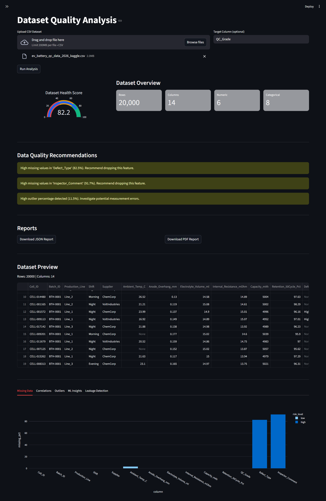
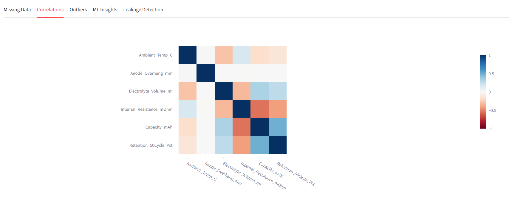
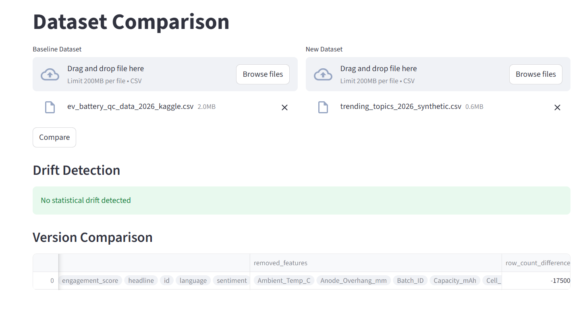
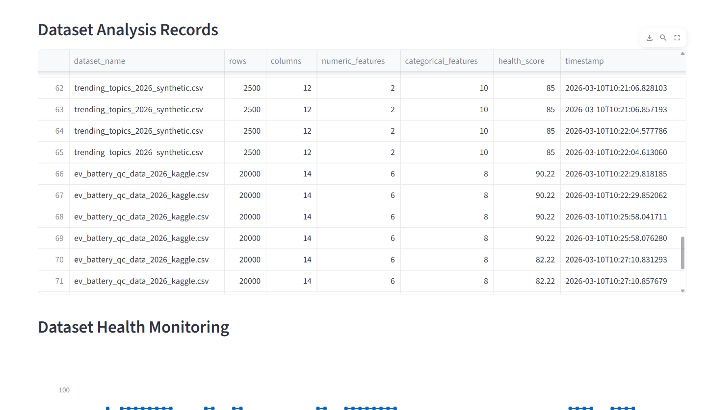

# AI Dataset Quality Analyzer

A full-stack **Machine Learning Dataset Monitoring Platform** that automatically evaluates dataset quality, detects anomalies, analyzes model readiness, and monitors dataset drift across versions.

This tool helps ML engineers and data scientists **identify data problems before training models**, reducing model failure caused by poor data quality.

---

# Overview

Machine learning systems heavily depend on data quality.
However, most datasets contain issues such as:

* Missing values
* Data leakage
* Outliers
* Feature correlation
* Class imbalance
* Dataset drift

These issues often reduce model performance and reliability.

The **AI Dataset Quality Analyzer** automatically detects these problems and provides an interactive dashboard to analyze dataset health before training machine learning models.

The platform combines **FastAPI (backend)** with **Streamlit (analytics dashboard)** to deliver a complete dataset monitoring system.

---

# Key Features

### Dataset Diagnostics

Automatically analyzes datasets and reports:

* Dataset statistics
* Missing value analysis
* Duplicate detection
* Feature correlation analysis
* Outlier detection using statistical methods
* Class imbalance detection
* Data leakage detection
* Label noise analysis

---

### Machine Learning Insights

Automatically trains a **baseline ML model** and provides:

* Accuracy
* Precision
* Recall
* F1 Score
* RMSE
* R² Score
* Feature importance ranking

This helps evaluate **whether the dataset is suitable for training ML models**.

---

### Dataset Health Score

The system calculates a **Dataset Health Score (0–100)** based on:

* Missing data risk
* Duplicate risk
* Feature correlation risk
* Class imbalance risk
* Data leakage risk
* Label noise risk
* Outlier risk

This provides a quick measure of **dataset readiness for machine learning pipelines**.

---

### Dataset Comparison

Users can upload two datasets and analyze:

* Added features
* Removed features
* Dataset version differences

This is useful for **tracking dataset evolution** during ML development.

---

### Drift Detection

The system detects **statistical drift between datasets**, helping identify:

* Changes in feature distributions
* Dataset instability
* Model reliability risks

This is essential for **ML monitoring systems in production**.

---

### Interactive Dashboard

The platform provides a **visual analytics dashboard** that includes:

* Missing value visualizations
* Correlation heatmaps
* Outlier analysis charts
* Feature importance plots
* ML performance metrics
* Dataset comparison insights
* Drift detection results

---

### Report Generation

The platform can export results as:

* JSON analysis reports
* PDF reports for documentation

---

# Technology Stack

### Backend

* Python
* FastAPI
* Pandas
* NumPy
* Scikit-learn

### Dashboard

* Streamlit
* Plotly

### Machine Learning

* Random Forest models
* Statistical anomaly detection
* Correlation analysis
* Data leakage detection

---

# Project Architecture

```
AI-Dataset-Quality-Analyzer
│
├── app
│   ├── routes
│   │   └── dataset_routes.py
│   │
│   ├── services
│   │   ├── statistics.py
│   │   ├── missing_values.py
│   │   ├── duplicates.py
│   │   ├── correlation_analysis.py
│   │   ├── outliers.py
│   │   ├── leakage_detection.py
│   │   ├── baseline_model.py
│   │   ├── scoring.py
│   │   ├── drift_detection.py
│   │   └── history_tracking.py
│   │
│   └── utils
│       └── helpers.py
│
├── dashboard
│   └── streamlit_dashboard.py
│
├── sample_datasets
│   ├── ev_battery_qc_data_2026_kaggle.csv
│   └── trending_topics_2026_synthetic.csv
│
├── requirements.txt
└── README.md
```

---

# Installation

Clone the repository:

```
git clone https://github.com/YOUR_USERNAME/AI-Dataset-Quality-Analyzer.git
```

Navigate to the project folder:

```
cd AI-Dataset-Quality-Analyzer
```

Install dependencies:

```
pip install -r requirements.txt
```

---

# Running the Application

### Start the FastAPI Backend

```
python -m uvicorn app.main:app --reload
```

The API server will start at:

```
http://127.0.0.1:8000
```

---

### Launch the Streamlit Dashboard

```
streamlit run dashboard/streamlit_dashboard.py
```

The dashboard will open at:

```
http://localhost:8501
```

---

# Example Workflow

1. Upload a dataset through the dashboard.
2. Run automated dataset diagnostics.
3. View dataset health score and risk analysis.
4. Analyze missing values, correlations, and outliers.
5. Evaluate baseline ML model performance.
6. Detect potential data leakage.
7. Compare dataset versions.
8. Detect statistical drift between datasets.
9. Export results as JSON or PDF reports.

---

# Example Use Cases

This tool can be used for:

* Machine learning dataset validation
* Data quality monitoring
* Detecting data leakage before model training
* Identifying dataset drift in ML pipelines
* Dataset version comparison
* ML experimentation workflows

---

# Screenshots

Dataset Analysis Dashboard



Machine Learning Insights



Dataset Comparison



History Monitor



---

# Resume Description

Built a **machine learning dataset monitoring platform** that performs automated dataset diagnostics including missing value detection, correlation analysis, outlier detection, class imbalance analysis, and data leakage identification.

Designed a **dataset health scoring system** to evaluate data readiness for machine learning pipelines.

Implemented **baseline ML evaluation using Random Forest models** and developed an interactive analytics dashboard using **FastAPI and Streamlit**.

---

# Future Improvements

* Dataset version control system
* Automated data cleaning suggestions
* Model performance monitoring
* Integration with ML pipelines
* Real-time data drift alerts

---

# License

MIT License
